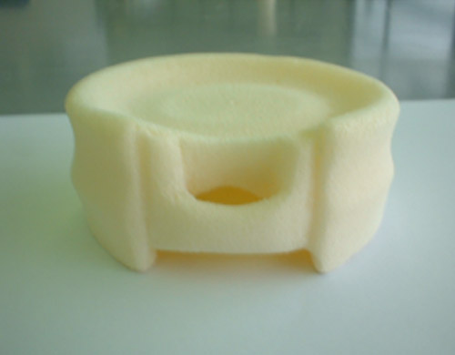
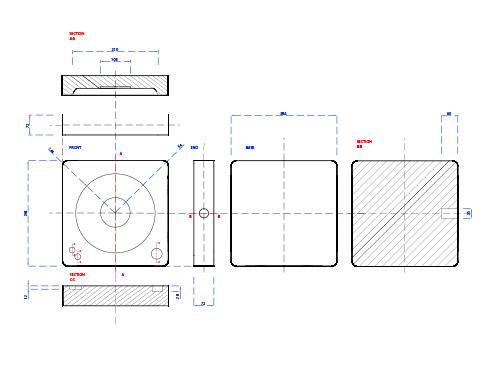

Product designers are responsible for giving form, function and meaning to a range of products that furnish our everyday lives. Their creative and practical input provides the essential link between the consumer and the manufacturer. 

I completed a degree in product design and development at the University of Salford in 2007. The course was made up of several modules including:

- User research and persona development
- Sketch work
- Foam and card model making
- Computer modeling and animation
- Technical drawing
- Graphic design

<section class="portfolio-images">

<h4>Sketch work</h4>
    

        
    

<h4>Foam model making</h4>
    

        
    

</section>

<section class="portfolio-images">
    

    <h4>Technical drawing</h4>
        

            
        

    

    <h4>User research</h4>
        

            
        

    

</section>

<section class="portfolio-images">
    

    <h4>Graphic design</h4>
        

            
        

    

    

<h4>Computer modeling</h4>
    

        
    

</section>

