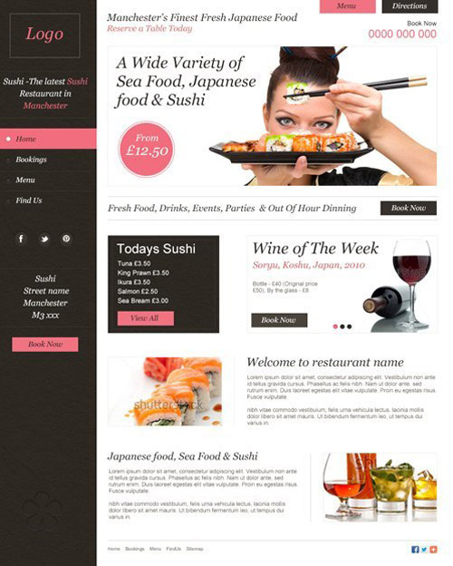
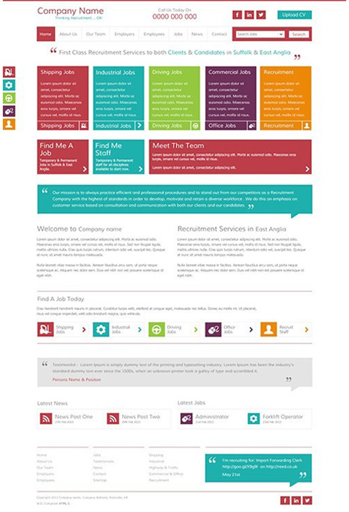

done: true

Creare are a full service web design and internet marketing agency based in Rugby, Warwickshire. The team of over 100 employees come from a wide range of backgrounds including web design, development, marketing and graphic design. Based in the centre of the UK, Creare operate nationally throughout England and Wales.

<h2 class="heading">My role</h2>
I was employed by Creare in 2011 as a design and front end development team leader. I was responsible for the delivery of web projects for SMEs through from the initial design concept to the front end development and SEO using platforms such as Wordpress and Magento. 

I was also team leader for a small team of junior designers and developers responsible for the management of the successful delivery of projects, as well as providing training and mentoring. 

Main responsibilities:

* Manageing a small team of designers helping with time management, project management and development skills
* Producing design concepts and prototypes
* Front end development and testing across multiple browsers, platforms, and devices
* Liasing with internal departments and coleauges to deliver the best user experience
* Project management of Magento and WordPress projects, delivering on time and meeting financial targets
* Training and supporting the members of my team

<h3 class="heading">Ecomerce websites</h3>

<section class="portfolio-images">

    

        
    

    

        
    

</section>

<h3 class="heading">Content managed websites</h3>

<section class="portfolio-images">

    

        
    

    

        
    

</section>

<h3 class="heading">static websites</h3>

<section class="portfolio-images">

    

        
    

    

        
    

</section>