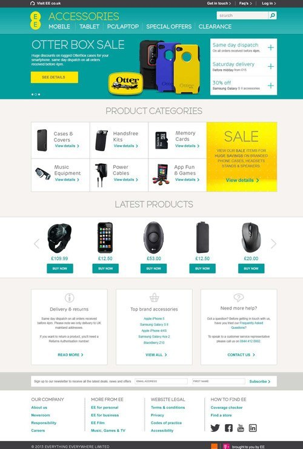
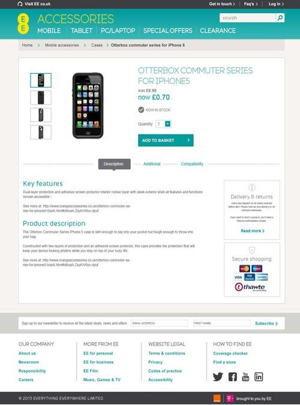

done: true

EE, part of the BT Group, is the largest and most advanced digital communications company in Britain, delivering mobile and fixed communications services. The company has approximately 553 retail stores, and services more than 31 million connections across its mobile, fixed and wholesale networks. Established in 2010 EE was a joint venture
between Deutsche Telekom and Orange.

<h2 class="heading">My role</h2>
I was employed as lead designer on the re-branding of the Orange accessories website following the takeover by EE.
Working to a tight deadline and strict brand guidlines I designed and developed the new look Magento theme.

Main responsibilities:

- Working within the EE brand guidlines to produce design concepts for key site pages
- Producing visuals for the online stores promotional banners and adverts
- Front end Magento development and testing across multiple browsers, platforms, and devices

<h3 class="heading">Design concepts</h3>

<section class="portfolio-images">

    

        
    

    

        
    

    

        
    

</section>

