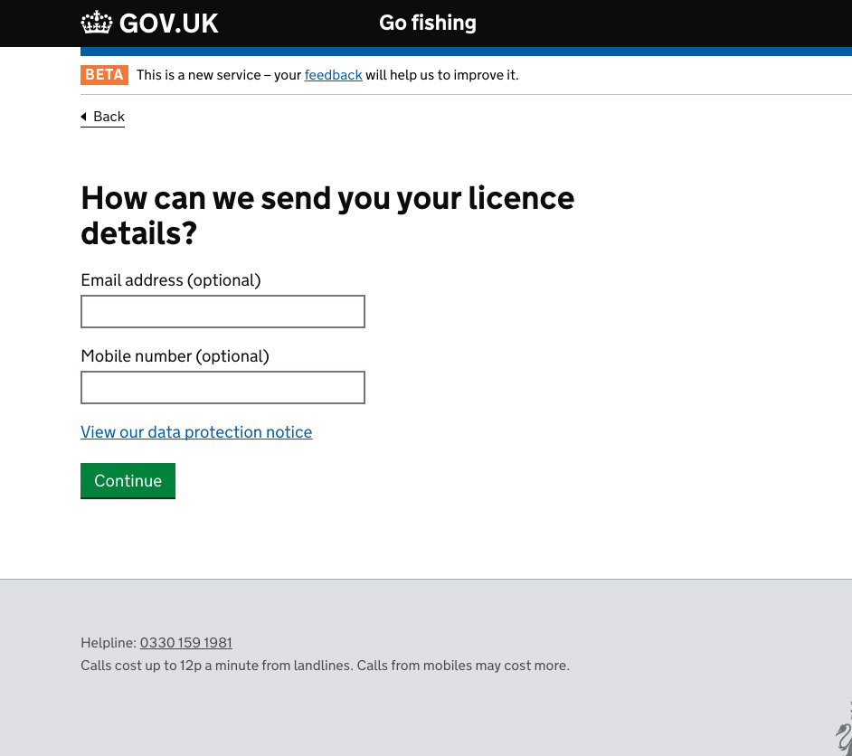
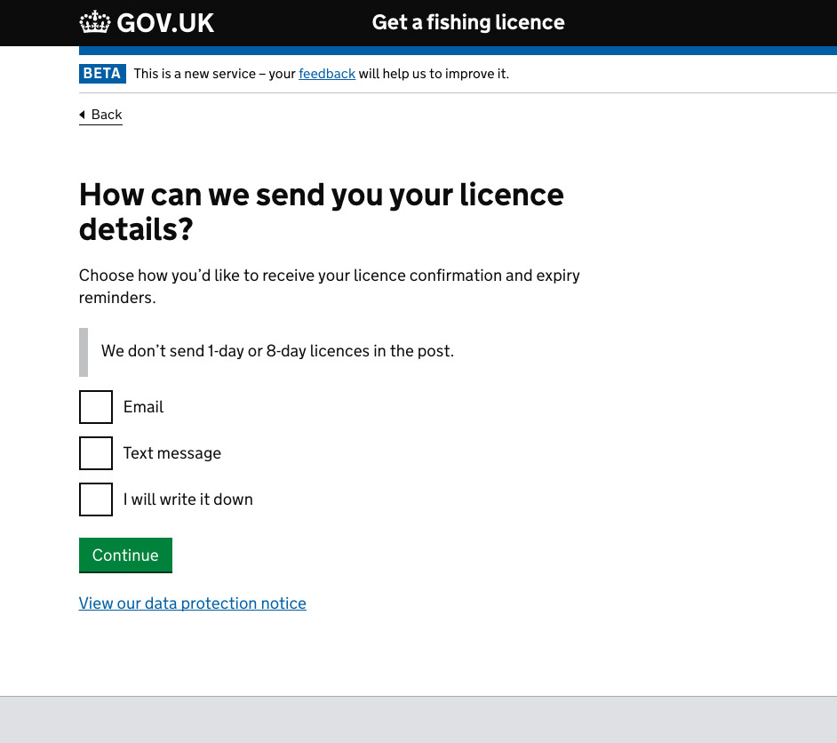
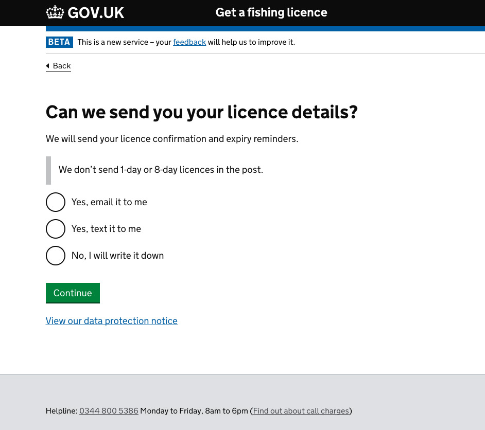
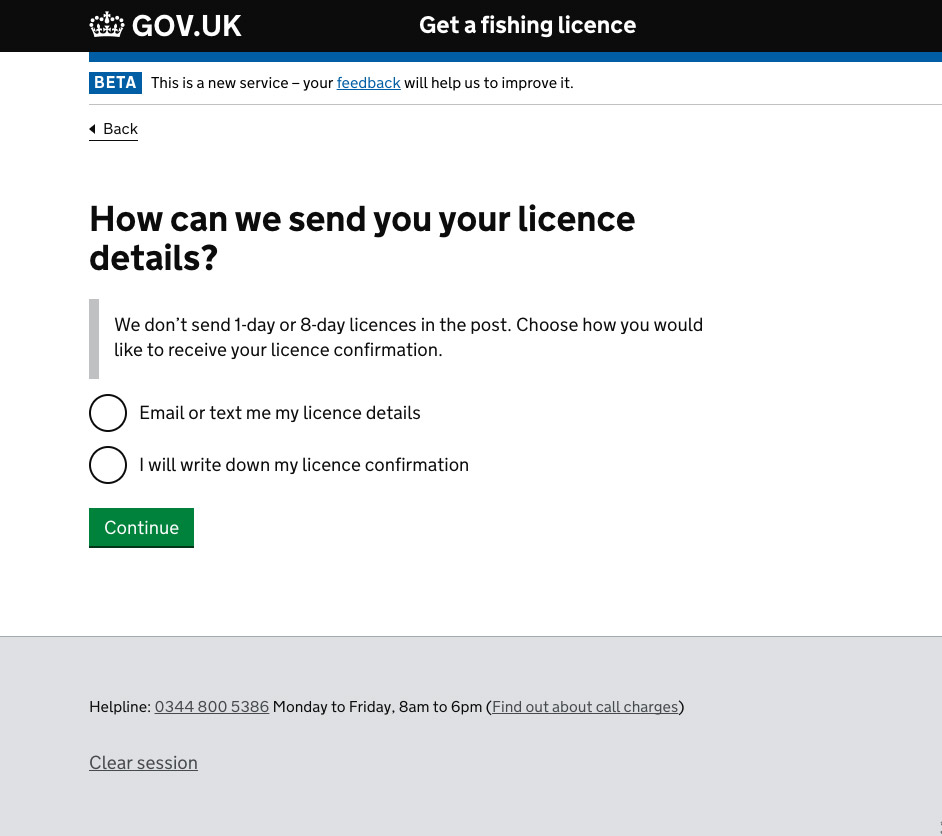
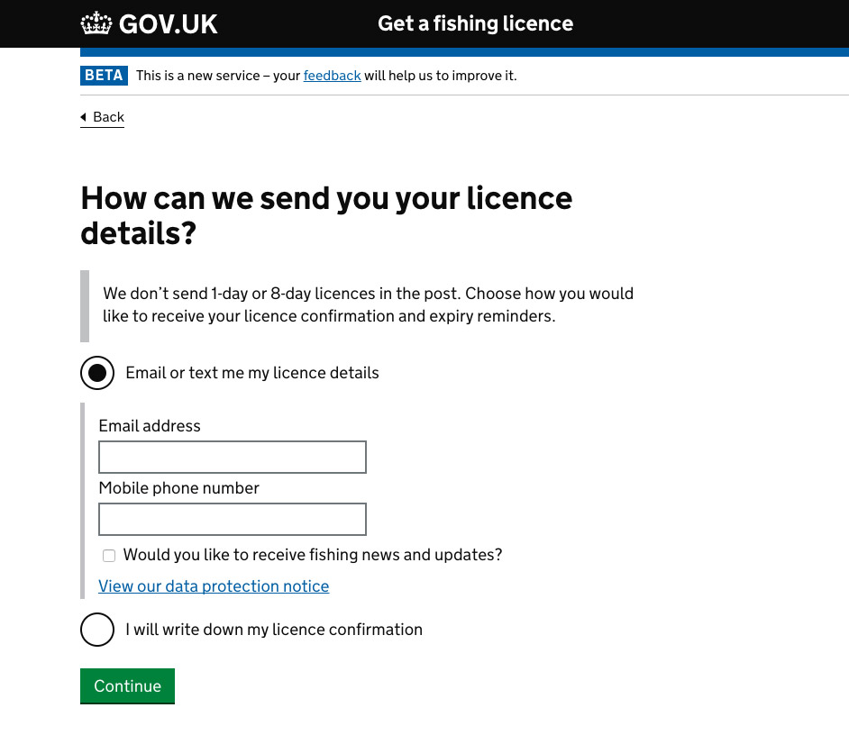
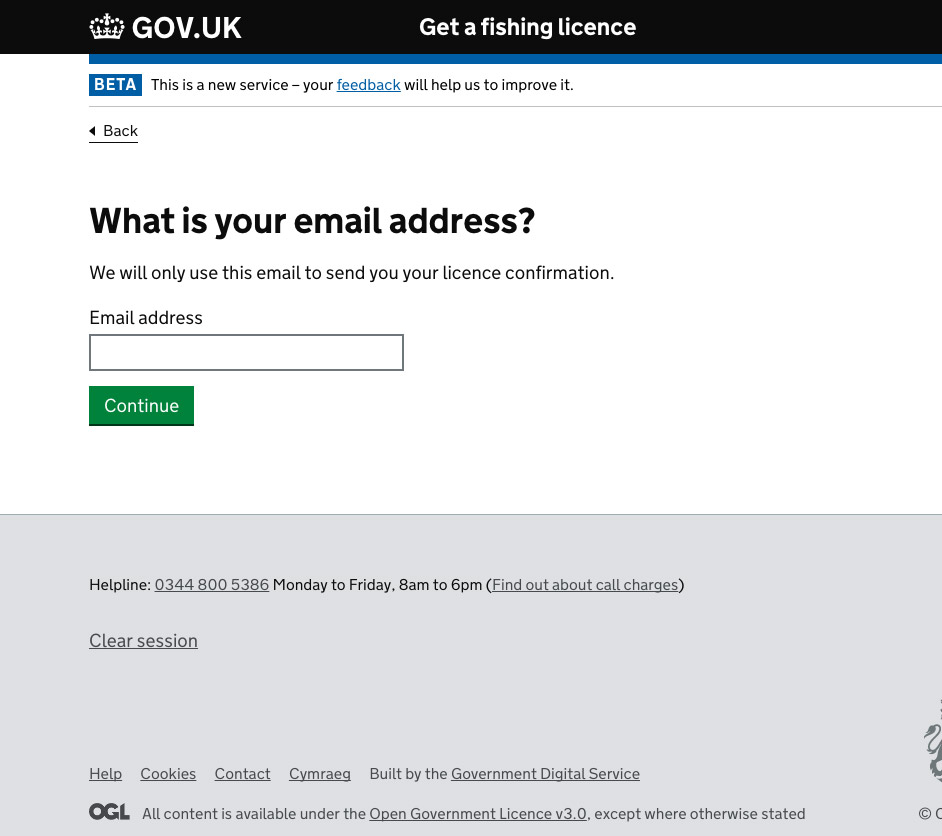
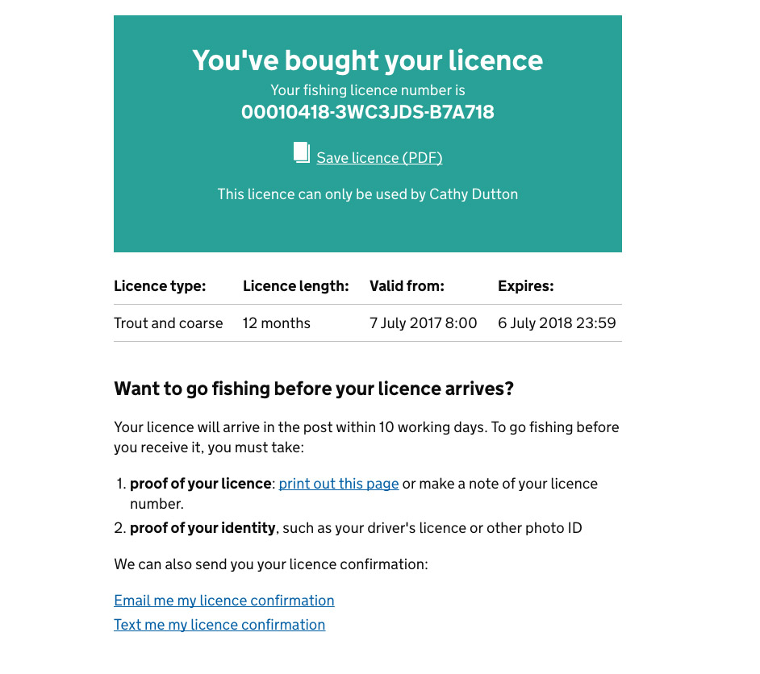
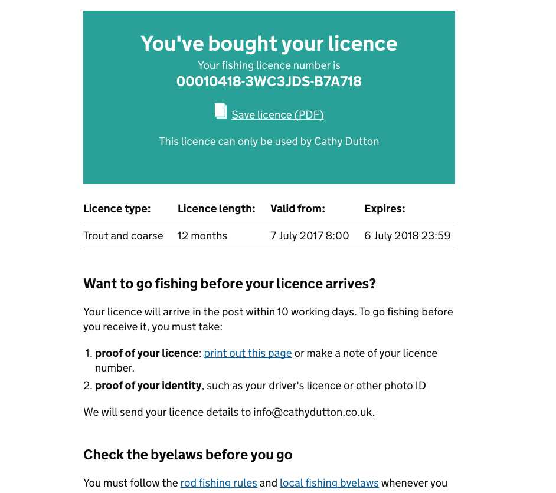

done: true

Each year the Environment Agency sells fishing licences to around a million customers generating £22 million of income that is re-invested back into the fisheries and the environment across England and Wales.

<h2 class="heading">My role</h2>
My role was to design, prototype and test a fully GDS compliant user journey and interface, working within an agile, multi-disciplinary team environment. I worked alongside a cross-section of business colleagues and key steakholders to ensure the service met both user and organisational needs.

During the project I was responsable for:

* Prototyping design concepts on paper, in code and with Balsamiq
* Observing user research sesions and defining outcomes
* Iterating designs to meet user needs and address research findings
* Delivering continous improvments to the live service based on user feedback gathered from online sales, call centres and analytics
* Designing and implementing tests to improve the userbility of design features
* Creating and sharing Google analytics reports
* Working as part of a multidisciplinary agile team
* Implementing Google tag manager and creating reports based on the data in Google analytics

<h2 class="heading">The service</h2>
The service passed its GDS public beta assesment and went live in January 2017 taking over £22million from 500,000 transactions in its first 2 months, with an estimated £40million and 1.2million transactions by the end of 2017. 
 
The service won a corporate services recognition award for “Making it simple” in March 2017 and was shortlisted at the <a href="http://www.digileaders100.com/" title="DL100 awards">DL100</a> awards for digital public service innovation in June 2017.

<h3 class="heading">Feedback</h3>

The service has over 94.5% Satisfied or very satisfied user feedback from over 22,000 responses via the onsite feedback form, just a few examples of this feebback are listed below:

<blockquote>
"The panel were particualrly impressed by the way the team have used what theyv'e learned to iteratte and improve the service. In particualr how they had explored different ways of frming questions and different question sequences"
</blockquote> 

GDS Director Kevin Cunnington referenced the service in an interview with Civil service world in March 2017:

<blockquote>
Whenever Kevin Cunnington talks about the digital services the government will have built by 2020, he starts by enthusing about applying for a fishing licence online.

Imagine CSW’s disappointment, then, when we ask the new director general of the Government Digital Service whether this focus on the gentle riverside pursuit is driven by a personal interest – and he responds with a quizzical look and a laugh. “No...” he says, pausing to check it isn’t a trick question. “It’s just a great application. I’m not a fisherman.
</blockquote>

Read the full <a href="http://www.civilserviceworld.com/articles/interview/interview-gds-leader-kevin-cunnington-whitehall-self-help-groups-spend-controls" title="Interview: GDS leader Kevin Cunnington - Civil service world">Civil service world interview</a>

 - Probably the easiest website I have ever used to make a purchase. Well done
 - Excellent service and really appreciate change to validity from date of purchase
 - The whole process was very easy. The boxes and questions were intuitive. -  - Good effort, hard to see how it can be improved.
 - Cant see how you could make this any easier
 - I am a 71 year old pensioner and I Found the site very user friendly and easy to use!  --   Top Marks!
 - Very easy to navigate, and delighted junior licence is now free!
 - MUCH MUCH MUCH better than the previous post office website.
 - A lot easier , god its for 12 months with optional start date. - Well done, environment agency.

 
<h4 class="heading">Licence confirmation screen</h4>
The licence confirmation screen is used to capture the users details in order to send out notifacations including the users licence number, allowing them to go fishing before the physical licence arives.

Intitail feedback on the service suggested some users were unclear on the purpose of this screen.

Feedback:

 * It wasn't clear I would have to write the number down
 * Explicit information is needed to say how i will receive it - not clear if it will arrive by post or can be downloaded
 * What do you send if I give my contact details?
 * If I enter both I would expect to receive an email and a text message.
 * I’m writing this down… But I’d like you to email and text this to me too.

!!!!Show images of new screen with copy to explain the benefits of providing information to the user.

<section class="portfolio-images">

    

        
    

    

        
    

    

        
    

</section>

"Choose how you would like to receive this licence confirmation and your expiry reminders."

"Your licence will arrive in the post within 10 working days. You can go fishing before you receive it, but you must be able to produce your licence confirmation."

"We don’t send 1-day or 8-day licences in the post. Choose how you would like to receive your licence confirmation."

!!!!SHOW NEW IMAGES WITH MY NEW CONTENT

<section class="portfolio-images">

    

        
    

    

        
    

</section>

We also made plans to amend the functionality of the service to allow for both a text and an email to be sent if the user provides both

!!!SHOW IMAGES OF allowing users to opt in from the done screen

<section class="portfolio-images">

    

        
    

    

        
    

    

        
    

</section>

OUTCOMES
* Allow to opt in after seeing licence
* Make clear the inpackt of not giving information
* Alignwith law changes aroud data protecion

<h4 class="heading">User journey</h4>
Based on a combanation of user feedback and comments made at the GDS assesment we also looked into alternative screen orders for the service.

Feedback:

* Why do I have to give my blue badge number also, as I am 69 years old, therefore qualifying for a oap discount.?Surely this is unnecessary.I now have to go out to the car to find the Badge NUmber.Unnecessary info.
* I qualify for a concessionery licence on two counts 1) Age, I am 75 years old and 2) I have a blue badge. I wanted a concessionery licence on account of my AGE as that is always going to apply. However, your web site has made me apply because of my disability and a Blue Badge is reviewable, therefore people may not always qualify under Blue Badge rules, or a Blue Badge could be reviewed/continue/or be withdrawn part way through the licencing year.  Apart from this your site suited me very well.
* I can't understand why I have to input my blue badge number as well as my age. As you can see I am nearly 82 years old and I have renewed my licence over the internet before and I was never asked for my badge number. there was times that I was getting worried that I was on the right sight. As I am over 65 there should be no reason that you should request me to do so.

* Would be good to see a price list before any transactions start
* Would be good to see the price options at the beginning. - Easier than the previous method.
* At the section for number of rods it would be useful to have the price for 2 and 3 rods actually listed

Flow -  skip concession - price (decision driver) - future proof - junior journey

!!!SHOW ALL IMAGES FROM FLOW BLOGPOST

!!Add content from blog post

OUTCOMES
* show price
* skip concession
* future proof
* Streamline juniors

<h3 class="heading">Case studies 4) Content on rods page and licence type page</h3>

- Front loaded information
- The question about number of rods is very confusing. I have bought a Licence for two rods and hope this allows my wife to also fish but it is not clear. This is not good

!!Show 3 images of ideas

<section class="portfolio-images">

    

        
    

    

        
    

    

        
    

</section>

<h3 class="heading">Case studies 3) Date picker / progressive reveal - data driven design</h3>

Feedback:

 * “What’s the 12 for?”

<h3 class="heading">Case studies 5) Multibuy</h3>

Feedback:

 * Need to put in details twice as I need two two rod licences
 * It would be good especially why buying a 1 day licence to have the ability to add multiple to a basket and paying for them in one go
 * I would prefer the option to buy more than one licence at a time and have only one payment.  My husband and I both fish but I need to apply and pay separately for his licence.  I'm sure there would be families who would prefer this as well.
* 
Need to be able to make multiple entries. I have to go through this 5 times to cover everyone that fishes in our house.

broke down senarios:

Buy multiple licences for the same person on different day's - product issue?
Buy multiple licences for different people
Buy multiple licences to allow for up to 3 or 4 rods - Product issue

data driven - show charts

