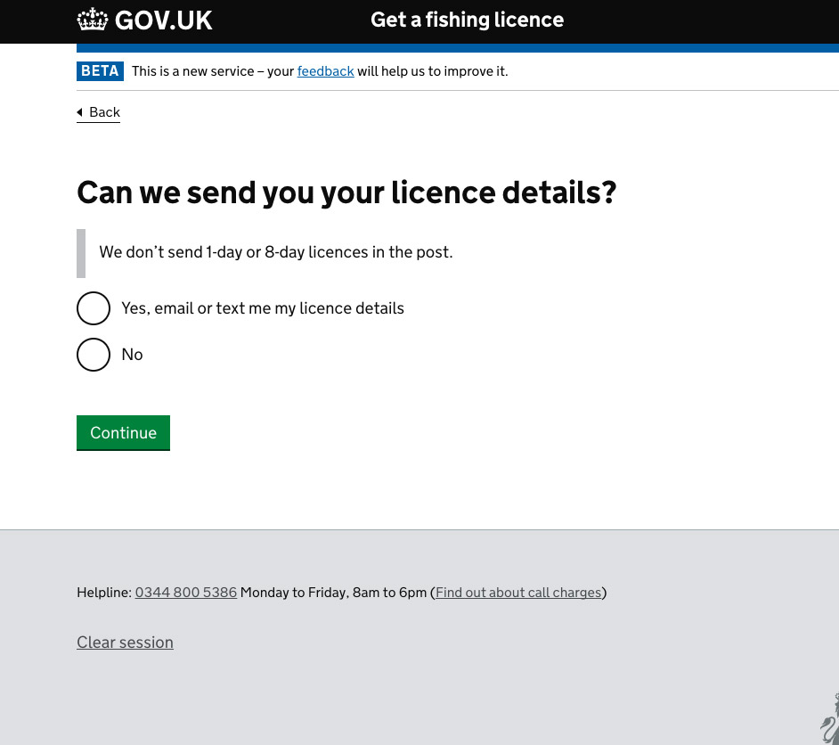
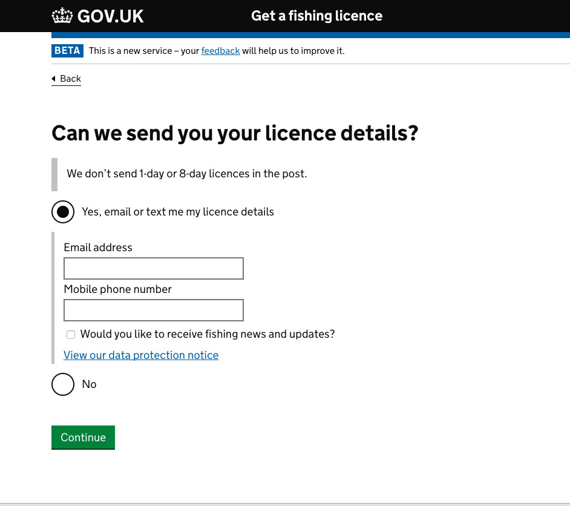
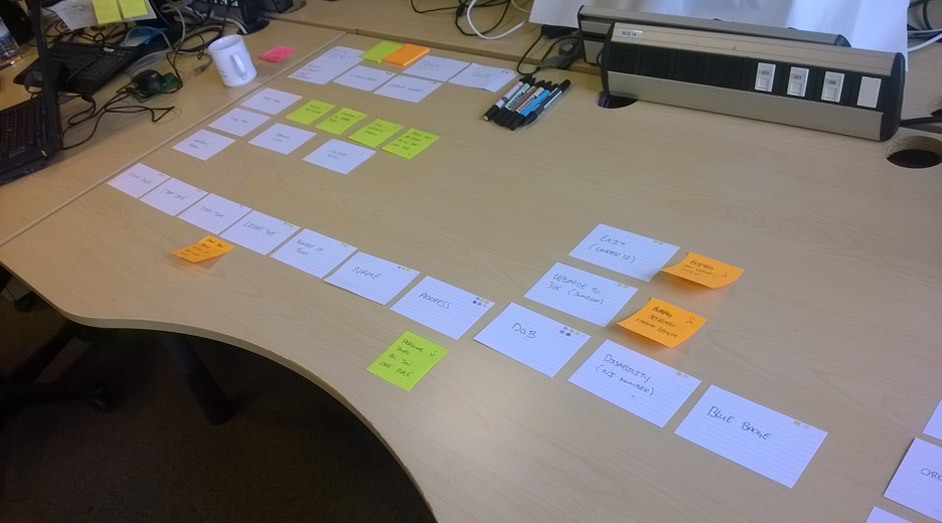
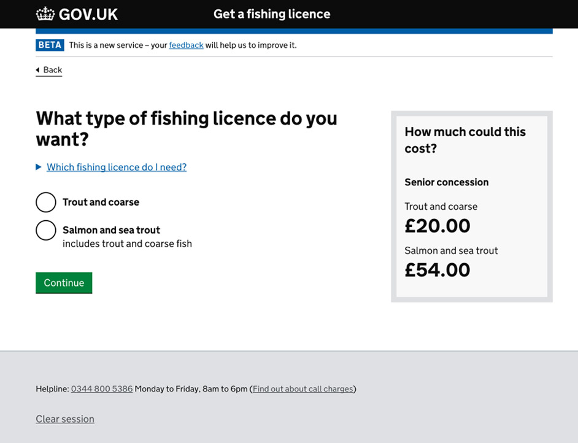
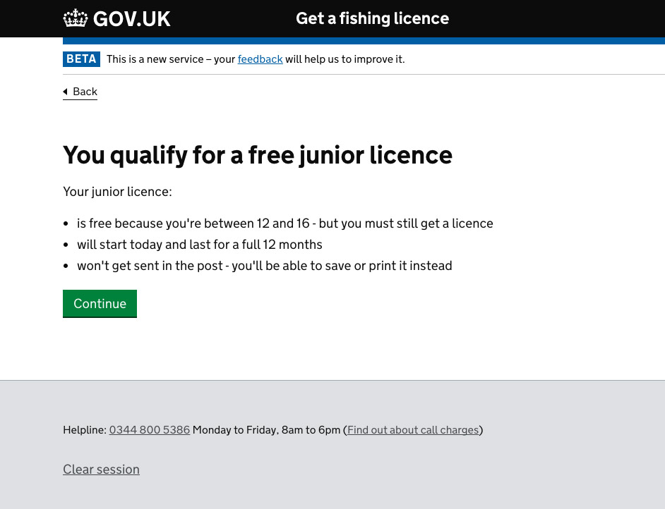
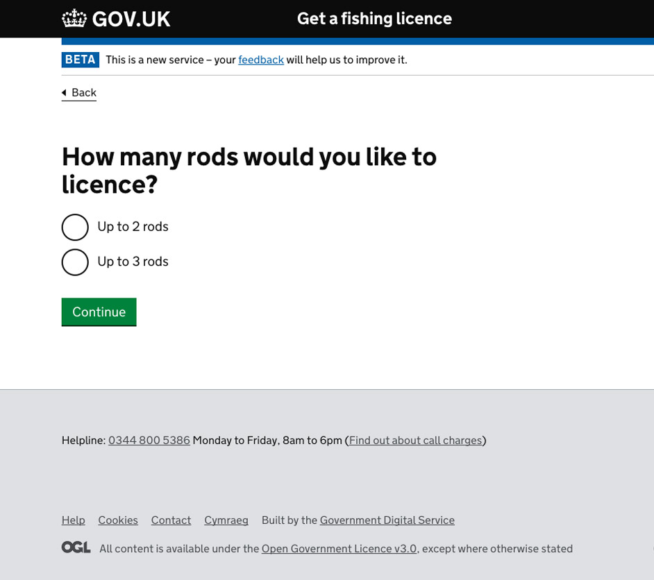
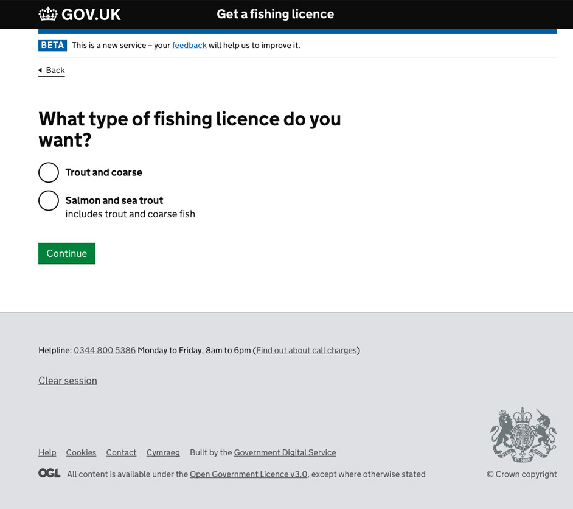
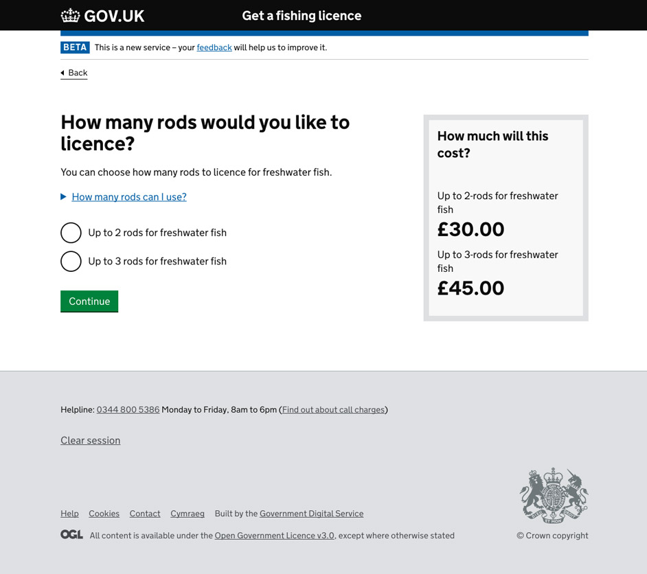
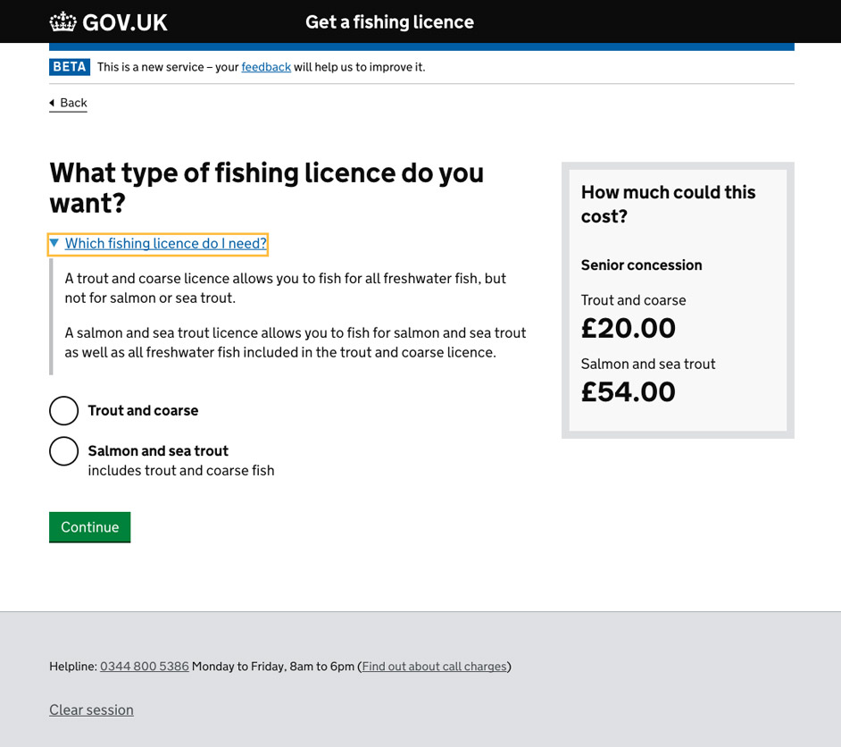

Each year the Environment Agency sells fishing licenses to around a million customers generating £22 million of income that is re-invested back into the fisheries and the environment across England and Wales.

<h2 class="heading">My role</h2>
My role was to design, prototype and test a fully GDS compliant user journey and interface, working within an agile, multidisciplinary team environment. I worked alongside a cross-section of business colleagues and key steak holders to ensure the service met both user and organisational needs.

During the project I was responsible for:

* <a href="interaction-design">Interaction design, prototyping design concepts on paper, in code and with Balsamiq</a>
* <a href="user-journey" class="heading">Creating an optimised user journey</a>
* <a href="data-driven-design" class="heading">Data driven design, designing and implementing tests to improve the userbility of design features</a>
* <a href="new-features" class="heading">Researching, testing and designing new features</a>
* <a href="content-design">Content design, delivering continuous improvements to the live service based on user feedback gathered from online sales, call centers and analytics</a>
* <a href="#">Creating and sharing Google analytics reports</a>

<h2 class="heading">The service</h2>
The service passed its GDS public beta assessment and went live in January 2017 taking over £22million from 500,000 transactions in its first 2 months, with an estimated £40million and 1.2million transactions by the end of 2017. 

The service won a corporate service's recognition award for “Making it simple” in March 2017 and was shortlisted at the <a href="http://www.digileaders100.com/" title="DL100 awards">DL100</a> awards for digital public service innovation in June 2017.

<blockquote>
"The panel were particualrly impressed by the way the team have used what theyv'e learned to iteratte and improve the service. In particualr how they had explored different ways of frming questions and different question sequences"
</blockquote> 

GDS assessment comments

 

<h3 class="heading">Feedback</h3>

The service has over 94.5% Satisfied or very satisfied user feedback from over 22,000 responses via the on site feedback form, just a few examples of this feebback are listed below:

<blockquote>
"Whenever Kevin Cunnington talks about the digital services the government will have built by 2020, he starts by enthusing about applying for a fishing licence online.

Imagine CSW’s disappointment, then, when we ask the new director general of the Government Digital Service whether this focus on the gentle riverside pursuit is driven by a personal interest – and he responds with a quizzical look and a laugh. “No...” he says, pausing to check it isn’t a trick question. “It’s just a great application. I’m not a fisherman."
</blockquote>

GDS Director Kevin Cunnington referenced the service in an interview with Civil service world in March 2017

Read the full <a href="http://www.civilserviceworld.com/articles/interview/interview-gds-leader-kevin-cunnington-whitehall-self-help-groups-spend-controls" title="Interview: GDS leader Kevin Cunnington - Civil service world">Civil service world interview</a>

User feedback:

 - "Probably the easiest website I have ever used to make a purchase. Well done"
 - "Excellent service and really appreciate change to validity from date of purchase"
 - "The whole process was very easy. The boxes and questions were intuitive. -  - Good effort, hard to see how it can be improved."
 - "Cant see how you could make this any easier"
 - "I am a 71 year old pensioner and I Found the site very user friendly and easy to use!  --   Top Marks!"
 - "Very easy to navigate, and delighted junior licence is now free!"
 - "MUCH MUCH MUCH better than the previous post office website."
 - "A lot easier , god its for 12 months with optional start date. - Well done, environment agency."

<h4 id ="interaction-design" class="heading">Case study - Interaction design</h4>

The licence confirmation screen is used to capture the users details in order to send out notifacations including the users licence number and renewal reminders. Initial feedback on the service suggested some users were unclear on the purpose of this screen.

Feedback:

 * "It wasn't clear I would have to write the number down"
 * "What do you send if I give my contact details?"

<section class="portfolio-images">

    

        
    

</section>

Outcomes:

 * Amend the functionality of the service to allow for both a text and an email to be sent if the user provides both
 * Allow users to opt in to notify from the done screen 
 * Replay the chosen contact details on the done screen
 * Clearly state the benefits of providing contact details 

<section class="portfolio-images">

    

        
    

    

        
    

</section>

<h4 id ="user-journey" class="heading">Case study - User journey</h4>

Based on a combanation of user feedback, call centre feedback and comments made at the GDS assesment we also looked at optermising the user journey.

Feedback:

* "seemed to take a long time compared with previous system"
* "poorly designed, far too long"
* "quick intuitive process/ would like to see one major improvement though/ PLS: include price for license"
* "Would be good to see a prices"
* "At the section for number of rods it would be useful to have the price for 2 and 3 rods actually listed"
* "I can't understand why I have to input my blue badge number as well as my age. As you can see I am nearly 82 years old"

<section class="portfolio-images">

    

        
    

</section>

Outcomes:
* Move licence length to the front - To future proof service and allow for new products
* Move address screen - To sit next to user information (Name and DOB screens)
* Move concession screens - Allows us to add accurate pricing on licence type and number of rods screens
* Seniors skip concession screens - These provide no added value for the users
* Juniors skip concession screens - These provide no added value for the users & under 16’s have no NI number

<section class="portfolio-images">

    

        
    

    

        
    

</section>

!!!!!!!!!! <h4 id ="data-driven-design" class="heading">Case study - Data driven design</h4>

!!!!!!!!!!  <h4 id ="new-features" class="heading">Case study - New features</h4>

<h4 id ="content-design" class="heading">Case study - Content design</h4>

Google analytics shows over half of users do not see the static pages which explain the different licence types and number of rod rules.
Therefore we needed to introduce clearer content throughout the journey.

Feedback:

* "Which fishing licence do I need?"
* "The question about number of rods is very confusing. I have bought a Licence for two rods and hope this allows my wife to also fish but it is not clear. This is not good"

<section class="portfolio-images">

    

        
    

    

        
    

</section>

Outcomes:

* Each page displays the relevant information to aid in experienced users

<section class="portfolio-images">

    

        
    

    

        
    

</section>

<!-- <h3 class="heading">Case studies 3) Date picker / progressive reveal - data driven design</h3>

Feedback:

 * “What’s the 12 for?” -->

<!-- <h3 class="heading">Case study - Multibuy</h3>

Feedback:

 * Need to put in details twice as I need two two rod licences
 * It would be good especially why buying a 1 day licence to have the ability to add multiple to a basket and paying for them in one go
 * I would prefer the option to buy more than one licence at a time and have only one payment.  My husband and I both fish but I need to apply and pay separately for his licence.  I'm sure there would be families who would prefer this as well.
* 
Need to be able to make multiple entries. I have to go through this 5 times to cover everyone that fishes in our house.

broke down senarios:

Buy multiple licences for the same person on different day's - product issue?
Buy multiple licences for different people
Buy multiple licences to allow for up to 3 or 4 rods - Product issue

data driven - show charts -->

