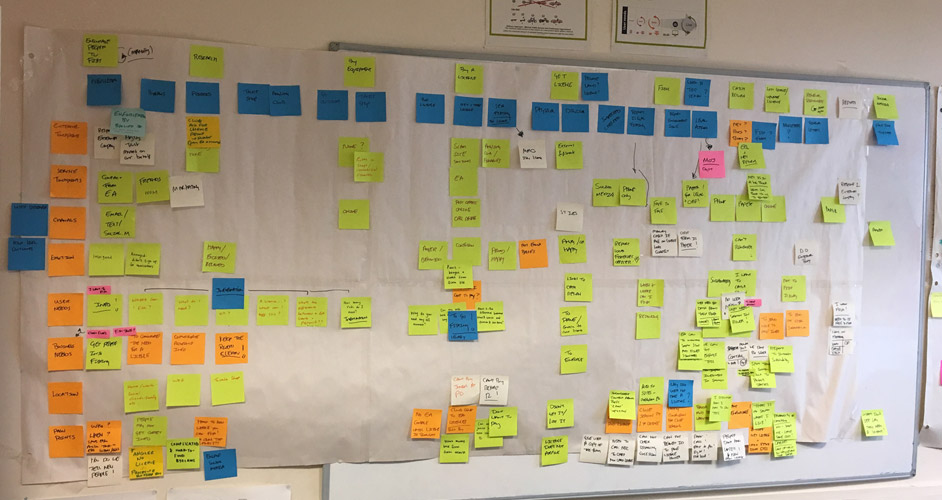
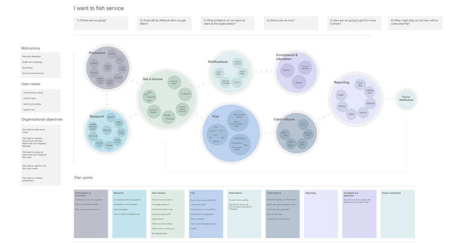

Angling generates over £1 billion for the UK economy, and is a much loved outdoor sport connecting people with nature. Each year the Environment Agency sells fishing licences to around a million customers generating £22 million of income that is re-invested back into the fisheries and the environment across England and Wales. 

<h2 class="heading">My role</h2>

I was hired in 2016 as an interaction designer on the 'Buy a rod fishing licence' service. After the successful launch of the service into private beta I began to look at the end to end service for Anglers, taking on the responsibility of creating an as is service map to highlight user needs, organisational needs and pain points in the service.

During the project I was responsible for:

 * Working with the Fisheries department, Bailiffs, marketing team and anglers to get a clearer understanding of the service goals
 * Creating a service map to show the current end to end service, pain points and outcomes
 * Work towards a service methodology to help create a service vision and mission statement
 * Creating an assumption map to be used in user research to prove or disprove ideas for improving the service

<section class="portfolio-images">

    

        
    

</section>

<section class="portfolio-images">

    

        
    

</section>

Outcomes:

 * Improve the complince and understanding of angling byelwas
 * Improve the complince and understanding of catch returns for Salmon and sea trout anglers
 

 * Trust - Lack of understanding and visability around the EA, how licence money i spent and whats being done to improve Angling
 * Transparency - Cleareer comunication around where licence money is spent, what the EA does and how to be a compliant angler
 * Comunicaion - Mixed messages around compliance and particapation
 * Visability - Lack of visability for enforcement, maintenance and enhancement of angling
 * Complexity -  Complicated rules that vary on location, water and species

<!-- 

Highlighting key drivers for angling “Sense of achievement”, “Health and well being”, “social” etc.

Highlighting key user needs “I want to fish”, “I want to enjoy nature”, “I want to relax”

Highlight key organisational needs “We need to keep rivers clean”, “We need to conserve freshwater and migratory fish stocks and report on this too???”, and “We need to increase participation in order to improve the environment”

Working on service mapping and end to end user journeys, working with policy, bailiffs call centre staff, fisheries officers, users and the communications team to highlight key pain points in the current user journey.

Focus on the problem not the soloution

Work alongside the senior fisheries team etc to map out the future service vision, What we want to do, how we will get there, what will be different.

Discovery into catch returns 

Discovery into compliance

effecting stratergey and delivery plans based on service deisgn

## Outcomes

Remove the need to register for a free junior licence

Mssion statement created with User researcher
Future mapping
personas -->

<!-- https://docs.google.com/presentation/d/1Lj55TJ7anvdeOX6Yf7N9i31DsTUIpDd1GlMIRl5HSfY/edit#slide=id.g1ff92f32f6_0_555 -->
